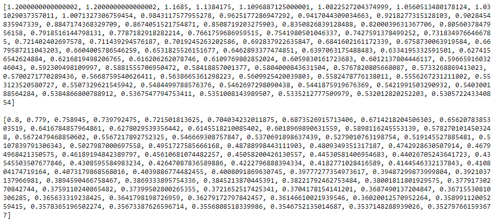

### EX NO: 04
### DATE: 08.04.2022
# <p align="center"> BACK PROPOGATION IN SINGLE NEURON</P>

## AIM:
To write a python program to perform Back Propagation in Single Neuron.

## Equipments Required:
1. Hardware – PCs
2. Anaconda – Python 3.7 Installation / Google Colab /Jupiter Notebook

## Related Theoritical Concept:
#### Training Dataset:
Training data is an extremely large dataset that is used to teach a machine learning model. Training data is used to teach prediction models that use machine learning algorithms how to extract features that are relevant to specific business goals. For supervised ML models, the training data is labeled. The data used to train unsupervised ML models is not labeled.
Training data is also known as a training set, training dataset or learning set.

#### Test data:
Test data is data which has been specifically identified for use in tests, typically of a computer program. Some data may be used in a confirmatory way, typically to verify that a given set of input to a given function produces some expected result.

#### Backward propagation:
Backpropagation (backward propagation) is an important mathematical tool for improving the accuracy of predictions in data mining and machine learning. Essentially, backpropagation is an algorithm used to calculate derivatives quickly.

</br>
</br>
</br>

## Algorithm
1.Inputs X, arrive through the preconnected path
2.Input is modeled using real weights W. The weights are usually randomly selected.
3.Calculate the output for every neuron from the input layer, to the hidden layers, to the output layer.
4.Calculate the error in the outputs

## Program:
```
/*
Program to implement Back Propagation in Single Neuron.
Developed by   : Gowri M
RegisterNumber :  212220230019
*/
```

```python
import numpy as np
i=1.5    
w_o=0.8  
y=0.5    
r=0.01   
def dc_dw(a,y,i):
  dc_da=2*(a-y)
  da_dw=i
  return dc_da*da_dw
  
w=[w_o]
a=[w_o*i]
for j in range(0,100):
  a.append(w[-1]*i)
  w.append(w[-1]-r*dc_dw(a[-1],y,i))
  if(a[-1]-y)**2<0.001:
    break
print(a)
print(" ")
print(w)
```
</br>
</br>
</br>
</br>
</br>
</br>
</br>
</br>

## Output:
)


## Result:
Thus the Back Propagation in Single Neuron was successfully implemented using python programming.
